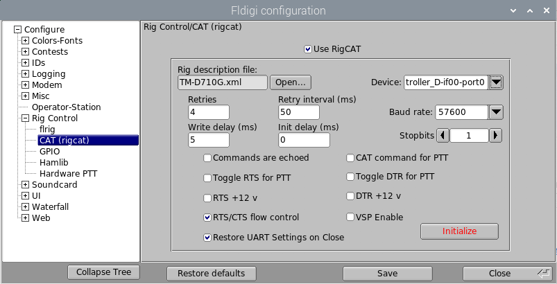
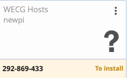

# Installation Instructions for Making a Nexus DR-X Raspberry Pi Image Suitable for WECG Remote Access

VERSION 20201118

## Prerequisites

- A Raspberry Pi 3B, 3B+ or 4B running the Nexus DR-X image and connected to the Internet
- A Kenwood TM-D710G or TM-V71A radio attached via serial cable to the Pi
- The RMSGW or APRS (`dw_aprs_gui.sh`) apps are configured and operating normally.
- You are a WECG administrator setting up the Pi for remote access by other WECG members

## Installation

### Scripts, Desktop Files and FLdigi RigCAT

__If you've already run the `install_wecg.sh` script on the Pi, skip to step 3.__

1. Use the Updater in the __Hamradio__ menu to update to the latest `nexus-utilites`.
1. Open a Terminal and run this command:

		install_wecg.sh
	Run it without arguments for instructions, then run it again with the appropriate arguments. When that completes, a browser will open and bring you to this page.
1. Open the Main Menu editor: __Raspberry > Preferences > Main Menu editor__ and arrange the items in the Hamradio menu as desired.  WARNING: Do not click __Cancel__ even if you make no changes! Click __OK__ instead. Clicking __Cancel__ will restore the menu to default settings.

Before continuing proceeding to the __Configure rigCAT in FLdigi__ step, please read the following warnings:

__IMPORTANT!__  The `710.sh` script will not work while Fldigi is running with rigCAT enabled because rigCAT has control of the serial port to the radio. Once Fldigi is stopped, you can again use `710.sh`.  
		
__IMPORTANT!__  The `710.py` GUI will not work while Fldigi is running with rigCAT enabled because rigCAT has control of the serial port to the radio. Once Fldigi is stopped, you can again use `710.py`.

***Now that you've read those warnings, you can decide whether or not to enable rigCAT in FLdigi. In other words, you have the choice of using rig control via rigCAT in FLdigi to control the radio's frequency or you can use `710.sh` or `710.py` to control the radio, but you cannot use either of these if rigCAT is enabled in FLdigi and FLdigi is running.***

__NOTE:__ If FLdigi is configured to use RigCAT and you run the Start script while 710.py is running, RigCAT will be temporarily disabled in FLDigi. When you stop FLdigi/FLmsg with the Stop script, RigCAT will be re-enabled in the FLdigi configuration.
 
1. Configure rigCAT in FLdigi (Optional)
	- Start FLdigi: __Raspberry > Hamradio > START FLdigi+FLmsg__.
	- Select __View > Rig/Log Controls > Full__.
	- Click __Configure > Config dialog > Rig Control > CAT (rigcat)__.
	- Click __Open__ and go to `.fldigi/rigs` and select the `TM-D710G.xml` file. Click __Open__.
	- In the __Device__ dropdown, select the serial port that starts with `/dev/serial/by-id/...`.
	- Select Baud rate `57600` and make sure the radio is set the same. It should be if you use the `710.sh` or `710.py` scripts.
	- Uncheck __CAT command for PTT__.
	- Check __RTS/CTS flow control__ and __Restore UART Settings on Close__.
	- Check the __Use rigCAT__ box.
	- Leave other settings as-is.
	
		The configuration should look like this:
	
		
	
	- Make sure the radio is on and it's serial cable is connected to the Pi.
	- Click __Initialize__. The radio's frequency should appear in the upper left corner of FLdigi.
	- Click __Save__, then __Close__ to close the configuration screen.
	- You can [change the frequency in FLdigi in a number of ways](http://www.w1hkj.com/FldigiHelp/rig_control_page.html). The easiest is to click on the leftmost digit in the frequency display, then type your desired frequency in KHz, then press __RETURN__.

	If you decide to switch off RigCAT at a later time (for example, if you want to use either of the 710 scripts instead), simply uncheck the __Use RigCAT__ box in Fldigi configuration window (__Rig Control__ > __CAT (rigcat)__)
1. Test the __START Fldigi+Flmsg__ and __STOP Fldigi+Flmsg__ and __KILL Fldigi+Flmsg__
menu items to make sure they work as desired.
	
### Install `dwagent`  
	
`dwagent` is the software that allows remote access to the Pi using [DWService](https://www.dwservice.net/).
1. Open a browser on any computer and log in to [DWService](https://www.dwservice.net/) as user `w7ecg.wecg@gmail/com`.
1. Click __Agents__.
1. Click __+__ at the top of the screen.
1. Select __WECG Hosts__ in the __Group__ dropdown.
1. Enter the Pi's hostname in the __Name__ field. This is usually the call sign. It does not have to exactly match the Pi's actual hostname and you can change the name later.
1. Enter a description. Include the location and any other information that users might find helpful.
1. Click __Confirm__.
1. A new screen will appear containing a 9 digit number. __Write this number down.__ It will look something like this:
	
	
		
1. Back on the Pi, open the Chromium browser and go to the [DWservice download page](https://www.dwservice.net/en/download.html).
1. Click the __Raspberry ARM (Linux)__ icon.
1. Click __Download__.
1. Open a Terminal and run these commands:
	
			cd Downloads
			chmod +x dwagent.sh
			./dwagent.sh
		
1. Select `1. Install` when prompted.
1. Accept default for Path.
1. Select `1. Yes` for the "Do you want to install..." question.
1. Select `1. Entering the installation code`.
1. Enter the __install code__ you wrote down earlier.
1. The script should finish the installation and start the DWAgent. Close the Chromium browser window.

### Convert the `dwagent` from a system service to a user service for security reasons.

By default, the dwagent runs as root, so that when you start a shell in the DWService web interface, you get a root shell.  That's not good.  Here's how to run the dwagent as another user.    

1. Stop and disable the service:

		sudo systemctl stop dwagent.service
		sudo systemctl disable dwagent.service
		
1. Make a folder for user level services and move the service file into it.  Run these commands:
		
		cd ~
		mkdir -p .config/systemd/user
		cd .config/systemd/user/
		sudo mv /etc/systemd/system/dwagent.service .
		sudo chown pi:pi dwagent.service
		
1. Open `dwagent.service` in an text editor and change this line:

		WantedBy=multi-user.target

	to:

		WantedBy=default.target
	
1.	Change the ownership of the `/usr/share/dwagent` folder and everything in it to user `pi`:

		cd /usr/share
		sudo chown -R pi:pi dwagent/
		
1.	Allow user `pi` to autostart services even if not logged in:

		sudo loginctl enable-linger pi
		
1. Enable and start the user service as user `pi` (not as `root`):

		systemctl --user enable dwagent.service
		systemctl --user start dwagent.service
		
	If you get an error message that says `Failed to connect to bus: No such file or directory`, then run the above `systemctl` commands like this instead:
	
		XDG_RUNTIME_DIR=/run/user/$UID systemctl --user enable dwagent.service
		XDG_RUNTIME_DIR=/run/user/$UID systemctl --user start dwagent.service
		
	From now on, the `dwagent.service` will start as user `pi` at bootup.

	
	